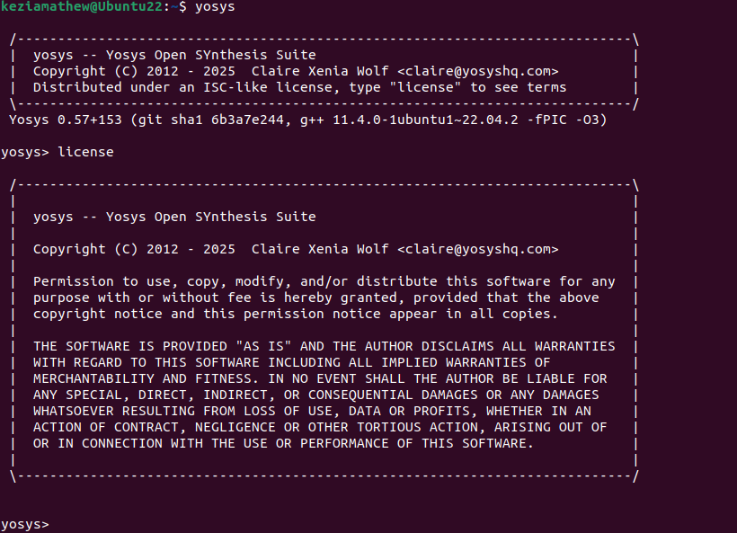
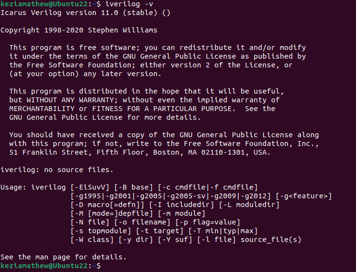
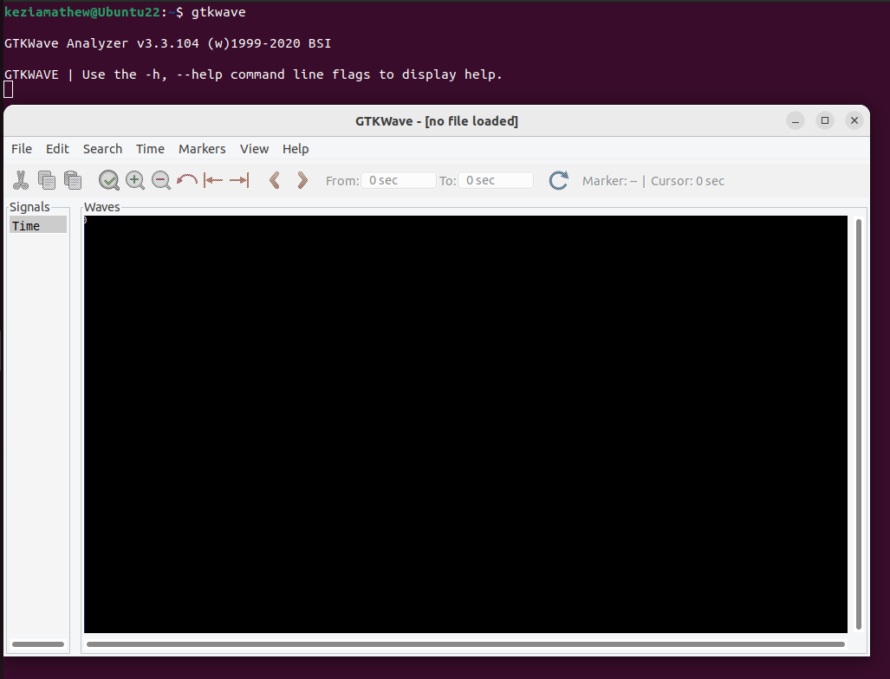

# VSDIAT_RISC-V_program
<details>
	<summary>Day 0 - Tools Installation </summary>
	
# Day 0 - Tools Installation
## Yosys-RTL Synthesis Tool
<summary><b>Purpose:</b> Converts RTL code into gate-level representations.</summary>
```
$ git clone https://github.com/YosysHQ/yosys.git
$ cd yosys 
$ sudo apt install make
$ sudo apt-get install build-essential clang bison flex \
    libreadline-dev gawk tcl-dev libffi-dev git \
    graphviz xdot pkg-config python3 libboost-system-dev \
    libboost-python-dev libboost-filesystem-dev zlib1g-dev
$ make 
$ sudo make install
```



## iverilog-Verilog simulator
<summary><b>Purpose:</b> Compiles and simulates Verilog designs for functional verification.</summary>
```
$ sudo apt-get install iverilog
```


## GTKWave-Waveform viewer
<summary><b>Purpose:</b> Analyzes and visualizes simulation waveforms for debugging.</summary>
```
$ sudo apt update
$ sudo apt install gtkwave
```



</details>
